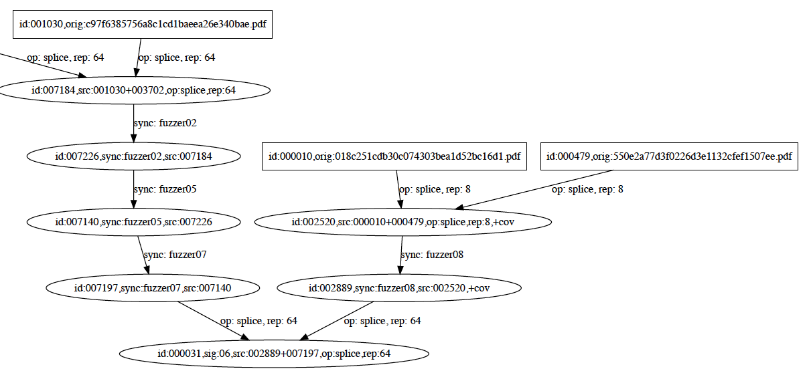

# AFL Mutation Chain

Recovers an approximation of the mutation chain that led to a particular seed in
an [AFL](http://lcamtuf.coredump.cx/afl/) queue.  Outputs the chain in either
JSON or Graphviz DOT format.

Example mutation chain, starting from the initial seed `seed`:

